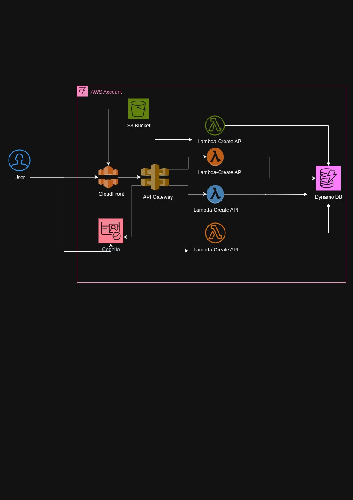

# CloudOpsPilot AWS Serverless Demo Application

A comprehensive REST API application built with AWS serverless technologies, featuring a modern frontend for testing CRUD operations. This application demonstrates a complete serverless architecture using AWS services.

## 🏗️ Architecture Overview

This application uses the following AWS services:

- **API Gateway**: REST API endpoints for CRUD operations
- **Lambda Functions**: Serverless compute for each CRUD operation (Create, Read, Update, Delete)
- **DynamoDB**: NoSQL database for data storage
- **Cognito**: User authentication and authorization
- **CloudFront**: Content delivery network for the frontend
- **S3**: Static website hosting for the frontend

### Architecture Diagram



**Data Flow:**
- **Frontend**: Users access the application through CloudFront, which serves static files from S3
- **API Requests**: API Gateway routes requests to appropriate Lambda functions
- **Database**: Lambda functions perform CRUD operations on DynamoDB
- **Authentication**: Cognito handles user authentication and authorization

## 📁 Project Structure

```
AWS-Serverless/
├── application/                    # Application source code
│   ├── lambda/                    # Lambda functions
│   │   ├── create/               # Create item function
│   │   ├── read/                 # Read items function
│   │   ├── update/               # Update item function
│   │   └── delete/               # Delete item function
│   └── frontend/                 # Frontend application
│       ├── html/                 # HTML files
│       ├── css/                  # CSS styles
│       └── js/                   # JavaScript files
├── terraform/                     # Terraform infrastructure
│   ├── main.tf                   # Main Terraform configuration
│   ├── variables.tf              # Variable definitions
│   ├── outputs.tf                # Output definitions
│   └── README.md                 # Terraform documentation
├── cloudformation/                # CloudFormation infrastructure
│   ├── template.yaml             # CloudFormation template
│   ├── deploy.sh                 # Deployment script
│   └── README.md                 # CloudFormation documentation
├── create_test_user.sh           # Script to create test user
└── README.md                     # This file
```

## 🚀 Complete Deployment Guide for Beginners

### Prerequisites Installation

Before you begin, you need to install the following tools on your system:

#### 1. Install AWS CLI
```bash
# For Ubuntu/Debian
sudo apt update
sudo apt install awscli

# For macOS (using Homebrew)
brew install awscli

# For Windows
# Download from: https://aws.amazon.com/cli/
```

#### 2. Install Terraform
```bash
# For Ubuntu/Debian
wget -O- https://apt.releases.hashicorp.com/gpg | sudo gpg --dearmor -o /usr/share/keyrings/hashicorp-archive-keyring.gpg
echo "deb [signed-by=/usr/share/keyrings/hashicorp-archive-keyring.gpg] https://apt.releases.hashicorp.com $(lsb_release -cs) main" | sudo tee /etc/apt/sources.list.d/hashicorp.list
sudo apt update
sudo apt install terraform

# For macOS (using Homebrew)
brew tap hashicorp/tap
brew install hashicorp/tap/terraform

# For Windows
# Download from: https://www.terraform.io/downloads
```

#### 3. Install Python 3.12
```bash
# For Ubuntu/Debian
sudo apt update
sudo apt install python3.12 python3.12-venv python3.12-pip

# For macOS (using Homebrew)
brew install python@3.12

# For Windows
# Download from: https://www.python.org/downloads/
```

#### 4. Install zip (if not already installed)
```bash
# For Ubuntu/Debian
sudo apt install zip

# For macOS
brew install zip

# For Windows
# Usually pre-installed, or download from: https://gnuwin32.sourceforge.net/packages/zip.htm
```

### Step-by-Step Deployment Instructions

#### Step 1: Clone the Repository
```bash
# Clone the repository
git clone <your-repository-url>
cd AWS-Serverless

# Verify the structure
ls -la
```

#### Step 2: Configure AWS Credentials
```bash
# Configure your AWS credentials
aws configure

# You will be prompted for:
# AWS Access Key ID: [Enter your access key]
# AWS Secret Access Key: [Enter your secret key]
# Default region name: ap-southeast-2
# Default output format: json

# Verify your configuration
aws sts get-caller-identity
```

#### Step 3: Deploy with Terraform (Recommended)

```bash
# Navigate to the Terraform directory
cd terraform

# Initialize Terraform
terraform init

# Create Lambda deployment packages
cd ../application/lambda
python3.12 -m venv venv
source venv/bin/activate
pip install boto3

# Package Lambda functions
cd create && zip -r create_item.zip . && cd ..
cd read && zip -r read_item.zip . && cd ..
cd update && zip -r update_item.zip . && cd ..
cd delete && zip -r delete_item.zip . && cd ..

# Return to Terraform directory
cd ../../terraform

# Plan the deployment
terraform plan

# Apply the deployment
terraform apply -auto-approve

# Wait for deployment to complete (this may take 10-15 minutes)
```

#### Step 4: Upload Frontend Files
```bash
# Get the S3 bucket name from Terraform outputs
S3_BUCKET=$(terraform output -raw s3_bucket_name)

# Upload frontend files
aws s3 cp ../application/frontend/html/index.html s3://$S3_BUCKET/
aws s3 cp ../application/frontend/css/styles.css s3://$S3_BUCKET/css/
aws s3 cp ../application/frontend/js/app.js s3://$S3_BUCKET/js/
```

#### Step 5: Create Test User

The `create_test_user.sh` script automatically creates a test user in AWS Cognito for you to log into the application. This script:

- Creates a user with username `test` and password `Test@1234`
- Sets the user's email to `test@example.com`
- Automatically confirms the user account
- Uses the Cognito User Pool ID from your Terraform deployment

**Prerequisites:**
- AWS CLI must be configured with appropriate permissions
- Terraform deployment must be completed successfully
- You must be in the root directory of the project

**Usage:**
```bash
# Navigate back to root directory (if you're in terraform/ directory)
cd ..

# Make the script executable
chmod +x create_test_user.sh

# Run the script
./create_test_user.sh
```

**What the script does:**
1. Retrieves the Cognito User Pool ID from Terraform outputs
2. Creates a new user in the Cognito User Pool with:
   - Username: `test`
   - Password: `Test@1234`
   - Email: `test@example.com`
3. Sets the user's password as permanent (no password change required)
4. Confirms the user account (no email verification needed)
5. Displays the created user credentials

**Expected output:**
```
✅ Test user created:
  Username: test
  Password: Test@1234
  Email: test@example.com
```

**Troubleshooting:**
- If you get "User already exists" error, the test user was already created in a previous run
- If you get "User Pool not found" error, ensure Terraform deployment completed successfully
- If you get permission errors, verify your AWS credentials have Cognito permissions

**Customizing the script:**
You can modify the script to create different test users by editing these variables:
```bash
USERNAME="your_username"
PASSWORD="your_password"
EMAIL="your_email@example.com"
REGION="your_aws_region"
```

#### Step 6: Get Your Application URLs
```bash
# Navigate to Terraform directory
cd terraform

# Get all outputs
terraform output

# The important URLs are:
# - Frontend: cloudfront_url
# - API: api_gateway_url
```

#### Step 7: Test Your Deployment
```bash
# Test frontend access
curl -I $(terraform output -raw cloudfront_url)

# Test API endpoint
curl -X GET $(terraform output -raw api_gateway_url)

# Test creating an item
curl -X POST $(terraform output -raw api_gateway_url) \
  -H "Content-Type: application/json" \
  -d '{"name": "Test Item", "description": "Test description", "category": "testing"}'
```

### Alternative: Deploy with CloudFormation

If you prefer CloudFormation over Terraform:

```bash
# Navigate to CloudFormation directory
cd cloudformation

# Create S3 bucket for Lambda code
aws s3 mb s3://serverless-crud-app-lambda-code-ap-southeast-2

# Package Lambda functions (same as above)
cd ../application/lambda
python3.12 -m venv venv
source venv/bin/activate
pip install boto3

cd create && zip -r create_item.zip . && cd ..
cd read && zip -r read_item.zip . && cd ..
cd update && zip -r update_item.zip . && cd ..
cd delete && zip -r delete_item.zip . && cd ..

# Upload Lambda packages to S3
aws s3 cp create/create_item.zip s3://serverless-crud-app-lambda-code-ap-southeast-2/create/
aws s3 cp read/read_item.zip s3://serverless-crud-app-lambda-code-ap-southeast-2/read/
aws s3 cp update/update_item.zip s3://serverless-crud-app-lambda-code-ap-southeast-2/update/
aws s3 cp delete/delete_item.zip s3://serverless-crud-app-lambda-code-ap-southeast-2/delete/

# Deploy CloudFormation stack
cd ../../cloudformation
chmod +x deploy.sh
./deploy.sh
```

## 🎯 Accessing Your Application

### Frontend Application
- **URL**: Use the `cloudfront_url` from Terraform outputs
- **Login Credentials**:
  - Username: `test`
  - Password: `Test@1234`

### API Endpoints
Use the `api_gateway_url` from Terraform outputs:

| Method | Endpoint | Description |
|--------|----------|-------------|
| POST | `/items` | Create a new item |
| GET | `/items` | Get all items |
| GET | `/items/{id}` | Get a specific item |
| PUT | `/items/{id}` | Update an item |
| DELETE | `/items/{id}` | Delete an item |

### Testing the API
```bash
# Get all items
curl -X GET "https://your-api-gateway-url.execute-api.ap-southeast-2.amazonaws.com/prod/items"

# Create a new item
curl -X POST "https://your-api-gateway-url.execute-api.ap-southeast-2.amazonaws.com/prod/items" \
  -H "Content-Type: application/json" \
  -d '{
    "name": "Test Item",
    "description": "This is a test item",
    "category": "test",
    "tags": ["test", "demo"]
  }'
```

## 🔧 Configuration Details

### Frontend Configuration
The frontend is configured in `application/frontend/js/app.js`:
- API Gateway URL
- Cognito User Pool ID
- Cognito Client ID

### Lambda Functions
Each Lambda function includes:
- Python 3.12 runtime
- boto3 for AWS SDK
- Environment variables for DynamoDB table name
- Proper error handling and CORS headers

### DynamoDB Schema
| Attribute | Type | Description |
|-----------|------|-------------|
| id | String (Primary Key) | Unique identifier |
| name | String | Item name (required) |
| description | String | Item description (required) |
| category | String | Item category (optional) |
| tags | List<String> | Item tags (optional) |
| created_at | String | Creation timestamp |
| updated_at | String | Last update timestamp |

## 🛠️ Troubleshooting Guide

### Common Issues and Solutions

#### 1. AWS CLI Not Found
```bash
# Verify AWS CLI installation
aws --version

# If not found, reinstall:
# Ubuntu/Debian: sudo apt install awscli
# macOS: brew install awscli
```

#### 2. Terraform Not Found
```bash
# Verify Terraform installation
terraform --version

# If not found, reinstall:
# Ubuntu/Debian: Follow installation steps above
# macOS: brew install hashicorp/tap/terraform
```

#### 3. Python 3.12 Not Found
```bash
# Verify Python installation
python3.12 --version

# If not found, install:
# Ubuntu/Debian: sudo apt install python3.12 python3.12-venv python3.12-pip
# macOS: brew install python@3.12
```

#### 4. AWS Credentials Not Configured
```bash
# Configure AWS credentials
aws configure

# Verify configuration
aws sts get-caller-identity
```

#### 5. Terraform Plan Fails
```bash
# Check for syntax errors
terraform validate

# Check AWS credentials
aws sts get-caller-identity

# Ensure you're in the correct region
aws configure get region
```

#### 6. Lambda Packaging Errors
```bash
# Ensure you're in the correct directory
cd application/lambda

# Create virtual environment
```

#### 7. CloudFront Access Issues
```bash
# Ensure index.html is at the root of S3 bucket
aws s3 mv s3://$(terraform output -raw s3_bucket_name)/html/index.html s3://$(terraform output -raw s3_bucket_name)/index.html

# CloudFront may take 5-10 minutes to update after changes
# Check CloudFront distribution status
aws cloudfront get-distribution --id $(terraform output -raw cloudfront_distribution_id)
```

#### 8. S3 Bucket Deletion Issues
```bash
# If you get "BucketNotEmpty" error during terraform destroy
aws s3 rm s3://$(terraform output -raw s3_bucket_name) --recursive
terraform destroy
```
python3.12 -m venv venv
source venv/bin/activate

# Install dependencies
pip install boto3

# Package functions
cd create && zip -r create_item.zip . && cd ..
cd read && zip -r read_item.zip . && cd ..
cd update && zip -r update_item.zip . && cd ..
cd delete && zip -r delete_item.zip . && cd ..
```

#### 7. CloudFront Access Denied
```bash
# Wait for CloudFront deployment (10-15 minutes)
# Check CloudFront status
aws cloudfront list-distributions

# Try accessing S3 website directly
# Use the s3_website_url from Terraform outputs
```

#### 8. API Gateway Errors
```bash
# Check Lambda function logs
aws logs tail /aws/lambda/serverless-crud-app-prod-create-item --follow

# Test API directly
curl -v https://your-api-gateway-url.execute-api.ap-southeast-2.amazonaws.com/prod/items
```

### Debugging Commands

```bash
# Check Terraform state
terraform show

# Check CloudFormation stack status
aws cloudformation describe-stacks --stack-name serverless-crud-app

# Check S3 bucket contents
aws s3 ls s3://your-bucket-name/

# Check Lambda functions
aws lambda list-functions --region ap-southeast-2

# Check DynamoDB table
aws dynamodb describe-table --table-name serverless-crud-app-prod-items --region ap-southeast-2
```

## 🧹 Cleanup Instructions

### Terraform Cleanup
```bash
cd terraform
terraform destroy -auto-approve
```

### CloudFormation Cleanup
```bash
aws cloudformation delete-stack --stack-name serverless-crud-app --region ap-southeast-2
aws cloudformation wait stack-delete-complete --stack-name serverless-crud-app --region ap-southeast-2
```

### Manual Cleanup (if needed)
```bash
# Delete S3 buckets
aws s3 rb s3://serverless-crud-app-prod-frontend --force
aws s3 rb s3://serverless-crud-app-lambda-code-ap-southeast-2 --force

# Delete DynamoDB table
aws dynamodb delete-table --table-name serverless-crud-app-prod-items --region ap-southeast-2
```

## 💰 Cost Estimation

This application is designed to be cost-effective:

- **DynamoDB**: Pay-per-request billing (~$1.25 per million requests)
- **Lambda**: Free tier includes 1M requests/month
- **API Gateway**: Free tier includes 1M requests/month
- **S3**: ~$0.023 per GB stored
- **CloudFront**: ~$0.085 per GB transferred

**Estimated monthly cost for light usage**: $5-15 USD

## 🔒 Security Considerations

### Current Security Features
- **IAM Roles**: Least privilege access for Lambda functions
- **DynamoDB**: Encrypted at rest
- **CloudFront**: HTTPS enforcement
- **CORS**: Properly configured

### Production Recommendations
1. **Enable Cognito Authentication**: Implement proper user authentication
2. **Add API Gateway Authorization**: Use Cognito authorizer
3. **Enable CloudTrail**: For audit logging
4. **Implement WAF**: Web Application Firewall
5. **Use Custom Domain**: Set up custom domain with SSL certificate
6. **Enable Monitoring**: Set up CloudWatch alarms

## 📊 Monitoring and Logging

### CloudWatch Logs
Lambda function logs are automatically sent to CloudWatch:
- `/aws/lambda/serverless-crud-app-prod-create-item`
- `/aws/lambda/serverless-crud-app-prod-get-items`
- `/aws/lambda/serverless-crud-app-prod-update-item`
- `/aws/lambda/serverless-crud-app-prod-delete-item`

### CloudWatch Metrics
Monitor these metrics in the AWS Console:
- **API Gateway**: Request count, latency, error rates
- **Lambda**: Invocation count, duration, error rates
- **DynamoDB**: Read/Write capacity units, throttled requests

## 🎨 Frontend Features

- **Modern UI**: Clean, responsive design with gradient backgrounds
- **Authentication**: Sign in/sign up functionality
- **CRUD Operations**: Full create, read, update, delete functionality
- **Search & Filter**: Real-time search through items
- **Responsive Design**: Works on desktop and mobile devices
- **Notifications**: Success/error feedback for user actions

## 📝 License

This project is licensed under the MIT License.

## 🤝 Contributing

1. Fork the repository
2. Create a feature branch
3. Make your changes
4. Test thoroughly
5. Submit a pull request

## 📞 Support

For issues and questions:
1. Check the troubleshooting section above
2. Review CloudWatch logs
3. Open an issue in the repository

---

**Note**: This is a demonstration application. For production use, implement proper security measures and follow AWS best practices.

## 🚀 **Postman API Testing Guide**

### **Base URL**
```
https://uytve9nmgf.execute-api.ap-southeast-2.amazonaws.com/prod/items
```

---

## 📝 **1. CREATE Operation (POST)**

### **Request Setup:**
- **Method:** `POST`
- **URL:** `https://uytve9nmgf.execute-api.ap-southeast-2.amazonaws.com/prod/items`
- **Headers:**
  ```
  Content-Type: application/json
  ```
- **Body (raw JSON):**
  ```json
  {
    "name": "Test Item from Postman",
    "description": "This is a test item created via Postman",
    "category": "testing",
    "tags": ["postman", "api", "test"]
  }
  ```

### **Expected Response:**
```json
{
  "message": "Item created successfully",
  "item": {
    "id": "uuid-here",
    "name": "Test Item from Postman",
    "description": "This is a test item created via Postman",
    "category": "testing",
    "tags": ["postman", "api", "test"],
    "created_at": "2025-07-17T07:48:14.058920",
    "updated_at": "2025-07-17T07:48:14.058920"
  }
}
```

---

## 📖 **2. READ All Items (GET)**

### **Request Setup:**
- **Method:** `GET`
- **URL:** `https://uytve9nmgf.execute-api.ap-southeast-2.amazonaws.com/prod/items`
- **Headers:** None required
- **Body:** None

### **Expected Response:**
```json
{
  "items": [
    {
      "id": "uuid-here",
      "name": "Test Item from Postman",
      "description": "This is a test item created via Postman",
      "category": "testing",
      "tags": ["postman", "api", "test"],
      "created_at": "2025-07-17T07:48:14.058920",
      "updated_at": "2025-07-17T07:48:14.058920"
    }
  ],
  "count": 1,
  "last_evaluated_key": null,
  "scanned_count": 1
}
```

---

## 📖 **3. READ Single Item (GET)**

### **Request Setup:**
- **Method:** `GET`
- **URL:** `https://uytve9nmgf.execute-api.ap-southeast-2.amazonaws.com/prod/items/{item-id}`
- **Headers:** None required
- **Body:** None

**Note:** Replace `{item-id}` with the actual ID from the CREATE response.

### **Example URL:**
```
https://uytve9nmgf.execute-api.ap-southeast-2.amazonaws.com/prod/items/718ad314-d6db-409e-b12c-85d7fcc8d864
```

### **Expected Response:**
```json
{
  "item": {
    "id": "718ad314-d6db-409e-b12c-85d7fcc8d864",
    "name": "Test Item from Postman",
    "description": "This is a test item created via Postman",
    "category": "testing",
    "tags": ["postman", "api", "test"],
    "created_at": "2025-07-17T07:48:14.058920",
    "updated_at": "2025-07-17T07:48:14.058920"
  }
}
```

---

## ✏️ **4. UPDATE Operation (PUT)**

### **Request Setup:**
- **Method:** `PUT`
- **URL:** `https://uytve9nmgf.execute-api.ap-southeast-2.amazonaws.com/prod/items/{item-id}`
- **Headers:**
  ```
  Content-Type: application/json
  ```
- **Body (raw JSON):**
  ```json
  {
    "name": "Updated Item from Postman",
    "description": "This item has been updated via Postman",
    "category": "updated",
    "tags": ["postman", "api", "updated", "test"]
  }
  ```

### **Expected Response:**
```json
{
  "message": "Item updated successfully",
  "item": {
    "id": "718ad314-d6db-409e-b12c-85d7fcc8d864",
    "name": "Updated Item from Postman",
    "description": "This item has been updated via Postman",
    "category": "updated",
    "tags": ["postman", "api", "updated", "test"],
    "created_at": "2025-07-17T07:48:14.058920",
    "updated_at": "2025-07-17T08:00:00.000000"
  }
}
```

---

## 🗑️ **5. DELETE Operation (DELETE)**

### **Request Setup:**
- **Method:** `DELETE`
- **URL:** `https://uytve9nmgf.execute-api.ap-southeast-2.amazonaws.com/prod/items/{item-id}`
- **Headers:** None required
- **Body:** None

### **Expected Response:**
```json
{
  "message": "Item deleted successfully",
  "item_id": "718ad314-d6db-409e-b12c-85d7fcc8d864"
}
```

---

## 🎯 **Step-by-Step Testing Workflow**

### **1. Create a Postman Collection**
1. Open Postman
2. Click "New" → "Collection"
3. Name it "CloudOpsPilot CRUD API"

### **2. Create Environment Variables**
1. Click "Environments" → "New"
2. Name it "CloudOpsPilot Environment"
3. Add these variables:
   - `base_url`: `https://uytve9nmgf.execute-api.ap-southeast-2.amazonaws.com/prod`
   - `item_id`: (leave empty, will be set dynamically)

### **3. Create Requests**

#### **Request 1: Create Item**
- Method: `POST`
- URL: `{{base_url}}/items`
- Headers: `Content-Type: application/json`
- Body: Use the CREATE JSON example above

#### **Request 2: Get All Items**
- Method: `GET`
- URL: `{{base_url}}/items`

#### **Request 3: Get Single Item**
- Method: `GET`
- URL: `{{base_url}}/items/{{item_id}}`

#### **Request 4: Update Item**
- Method: `PUT`
- URL: `{{base_url}}/items/{{item_id}}`
- Headers: `Content-Type: application/json`
- Body: Use the UPDATE JSON example above

#### **Request 5: Delete Item**
- Method: `DELETE`
- URL: `{{base_url}}/items/{{item_id}}`

### **4. Test Scripts (Optional)**

Add this script to the CREATE request to automatically set the item_id:

```javascript
<code_block_to_apply_changes_from>
```

---

## 📊 **Expected Status Codes**
- **200**: Success
- **201**: Created (for POST requests)
- **400**: Bad Request
- **404**: Not Found
- **500**: Internal Server Error

Now you can test all CRUD operations in Postman! Start with the CREATE operation to get an item ID, then test the other operations using that ID. 🚀